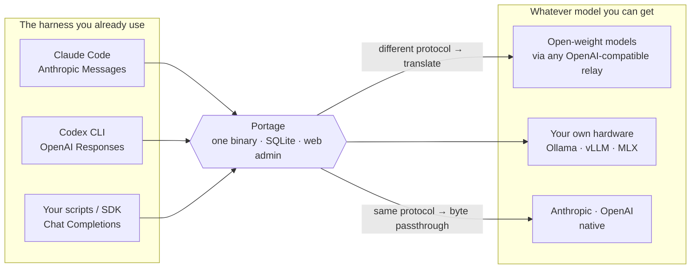

# Portage

**Keep the harness. Change the model.**

[](https://github.com/SimonGino/portage/actions/workflows/ci.yml)
[](https://go.dev)
[](#quick-start)

[English](README.md) · [简体中文](README.zh-CN.md)

Claude Code and Codex CLI are the reason the work gets done. What's behind them shouldn't
be decided by whoever wrote them.

But a harness talks exactly one protocol. Claude Code speaks Anthropic Messages, Codex CLI
speaks OpenAI Responses — and nearly every other model on earth is reached over OpenAI
Chat Completions: open-weight models, the relay you're already paying for, the endpoint on
your own GPU, your employer's internal deployment. Neither harness will ever call any of
them.

**Portage is the piece in between.** Point the harness at it, and the model on the other
side becomes a configuration line. No patched clients, no forked harness, no wrapper
scripts.



## What you can run

| The model you want | Reached over | In the harness |
| --- | --- | --- |
| **Open-weight models** — whatever the good one is this month | any OpenAI-compatible endpoint | Claude Code · Codex CLI |
| **Your own hardware** — Ollama, vLLM, LM Studio, MLX | Chat Completions on localhost | Claude Code · Codex CLI |
| **The relay or aggregator you already pay for** | Chat Completions or Responses | Claude Code · Codex CLI |
| **Your employer's internal deployment** | whichever of the three it exposes | Claude Code · Codex CLI |
| **Anthropic and OpenAI themselves** | their native protocol, bytes untouched | Claude Code · Codex CLI |

Crossing the two big vendors — Claude models inside Codex CLI, GPT models inside Claude
Code — falls out of the same machinery. It's a consequence, not the point.

Streaming (SSE) and tool calling work on every one of those paths. For an agent harness
those aren't features, they're the floor — a translation path without them is a
translation path that doesn't work.

## And while it's in the path

Once every request goes through one place, a few things become free:

| | |
| --- | --- |
| **Swap vendors without touching clients** | An *access point* is a stable public model name bound to real upstreams. Move it, and every harness follows. |
| **Stop handing out real vendor keys** | Portage issues its own `sk-ptg-…` keys. Upstream credentials never leave the server, never appear in a log or an error body. |
| **Survive a dead key at 3am** | Each channel holds a pool of credentials. A `401` pulls one out of rotation and the request continues on the next. |
| **Know where the tokens went** | One row per call — model, channel, the credential that actually served it, tokens including cache reads and writes, status, latency. |

> *portage (n.):* carrying a boat overland between two waterways that don't connect.
> **Carrying costs something — if you can float, don't land.** That's the name and the
> hard rule: when the two sides already speak the same protocol, raw bytes go straight
> through and nothing is transcoded. Translate only when you must, and say in the logs
> what got left on the bank.

## Quick start

The same binary runs in two shapes, and one thing decides which: whether an admin
password is set.

| | Admin password | Business configuration | What it's for |
| --- | --- | --- | --- |
| **With the console** | set | lives in the database, edited by clicking | the machine you configure *on* |
| **Forwarding only** | not set anywhere | comes from a declarative file | the machine you deploy *to* |

The intended path uses both, in three steps: **configure locally with the console →
export one `channels.yaml` → deploy that file to a forwarding-only instance.**

### 1. Configure locally, with the console

```bash
PORTAGE_ADMIN_PASSWORD='pick-a-password' \
  docker compose -f deploy/docker-compose.yml up -d --build
```

Open <http://127.0.0.1:8317/admin>, log in, and add a channel → managed models →
an access point → an API key. Test the upstreams from here: a forwarding-only instance
never probes anything, so whatever you don't verify on this machine, nobody verifies.

This instance never gets a declarative file mounted — its database stays the source of
truth and the console stays writable. So the database starts empty and the log merely
says so (`api_keys is empty, every forwarded request will 401`) until you've added a
key: a warning, not a failure, because on this shape configuring a key requires a
gateway that's already running. Mount a file and that same condition refuses to boot
instead — see step 3.

The admin password comes from the environment, not the config file — anything baked
into a config file inside an image is baked into that image's layer history. It seeds
the database on first boot; once a password is stored, changing the variable does nothing.

### 2. Export `channels.yaml`

One button at the foot of the console's left rail. It writes the whole business
configuration into a single file — every channel, managed model, credential, access
point and API key — and nothing about runtime state, so a `401` you hit locally doesn't
travel to the deployed machine as a disabled credential.

**The file carries secrets in cleartext**, both upstream credentials and `sk-ptg-…`
keys, because a redacted file can't be deployed and deploying it is the entire point.
It lands `0600`; keep it that way, and never commit it — `channels.yaml` is already in
`.gitignore`. The one file of this shape that *is* in git is `channels.example.yaml`,
and that one is a reference, not a config.

### 3. Deploy it, forwarding-only

Mount the file, point `PORTAGE_CHANNELS` at it, and set no admin password:

```yaml
# deploy/docker-compose.override.yml — compose merges this in automatically
services:
  portage:
    environment:
      PORTAGE_CHANNELS: /etc/portage/channels.yaml
    volumes:
      - ./channels.yaml:/etc/portage/channels.yaml:ro
```

Outside a container it's the `-channels` flag; `PORTAGE_CHANNELS` overrides it. The
environment variable has to exist because the image's `ENTRYPOINT` hard-codes `-config`.
There is no implicit default path and no search — a mistyped filename must fail loudly,
not degrade into silently serving whatever the database happened to hold.

With a file mounted, that file is the only source of truth for business configuration:
it's applied into the database at boot, entities missing from it are deleted, and with
no admin password there is no console left to write any of it. Anything statically
wrong — a candidate pointing at a channel that doesn't exist, an unknown field, an empty
`api_keys` list — fails the boot with exit code 1 and reports **every** problem at once
rather than stopping at the first, because the only way to fix one is edit-and-restart.
In a container that's a restart loop, and that's the point: the alternative is exiting 0
and disappearing quietly.

### Changing something later

Change it on the local instance, export again, redeploy the file, restart. The two
machines share nothing and there is no file watching — the declarative file is read once,
at boot.

<details>
<summary>Writing <code>channels.yaml</code> by hand (the secondary path)</summary>

[`channels.example.yaml`](channels.example.yaml) is real exporter output run over fake
data, pinned by a round-trip test (`export → apply → export`, byte-identical), which is
why it can be trusted as a field reference — a hand-maintained sample goes stale the
first time a field is renamed and nothing notices.

It is **not** a config you can run. The API key in it is the factory placeholder, and a
placeholder API key is refused at boot: it's a door key published in a public repo.
Unknown fields are refused too. Exported files never contain either, so the strict
parser costs the main path nothing and only bites here — at boot, on the machine you're
still standing next to.
</details>

<details>
<summary>Build from source (Go 1.26+ and Node)</summary>

```bash
make build          # builds the web admin and embeds it into bin/portage
./bin/portage
```

A plain `go build ./cmd/portage` works too — without the `webui` build tag, `/admin`
serves a "frontend not built" page. That's the path CI and Node-less machines take.
Note this is a build-time switch over the bundled assets only; whether the admin plane
exists at all is the password question above, not this tag.
</details>

<details>
<summary>Putting it on the public internet</summary>

Publish the container port to localhost only and terminate TLS in nginx in front of it,
exposing just `/v1`. See [`deploy/nginx.conf.example`](deploy/nginx.conf.example).
**Several nginx defaults are actively hostile to SSE** and must be overridden — get it
wrong and nothing errors, streams just hang or cut off.
</details>

## Claude Code

```bash
export ANTHROPIC_BASE_URL=http://127.0.0.1:8317
export ANTHROPIC_AUTH_TOKEN=sk-ptg-…    # your Portage key — never a vendor key
export ANTHROPIC_MODEL=gw-sonnet        # an access point name, or channel/model
claude
```

That's the whole setup. Claude Code keeps sending Anthropic Messages; Portage decides per
channel whether that goes out untouched or gets translated into Chat Completions or
Responses first. Keys are accepted as either `x-api-key` or `Authorization: Bearer`,
so `ANTHROPIC_API_KEY` works just as well as `ANTHROPIC_AUTH_TOKEN`.

Claude Code also fires background requests (titles, summaries) at a small fast model —
`ANTHROPIC_SMALL_FAST_MODEL` on older versions, `ANTHROPIC_DEFAULT_HAIKU_MODEL` on newer
ones. Point it at an access point too, or those requests go looking for a model name your
upstream may not have.

## Codex CLI

Configure Portage as a custom provider in `~/.codex/config.toml`:

```toml
model_provider = "portage"

[model_providers.portage]
name = "Portage"
base_url = "http://127.0.0.1:8317/v1"
wire_api = "responses"          # the gateway decides whether to translate downstream
env_key = "PORTAGE_API_KEY"     # your sk-ptg-… key, never an upstream key

[profiles.sonnet]
model = "gw-sonnet"
model_provider = "portage"
model_context_window = 200000   # must match the real upstream window
```

**You have to set `model_context_window` yourself** — this is the one thing the gateway
cannot do for you. Codex doesn't read `/v1/models`; it trusts its own built-in model
catalog. Give an access point a custom name like `gw-sonnet` and Codex falls back to a
272k window, putting auto-compaction around 245k. If the real upstream window is smaller,
the request hits the upstream's `400` long before compaction ever fires.

<details>
<summary>How remote compaction is handled (read this if you use long sessions)</summary>

When Codex decides to compact, it sends a request whose input tail carries a
`compaction_trigger` and expects **exactly one** compaction item back. Zero items is a
fatal, non-retryable error on the client. Portage handles the two cases differently:

- **Responses passthrough** — only allowed on channels whose upstream actually understands
  the trigger; tick *Codex compaction: supported* on the channel. Otherwise the request is
  refused with an explanatory `400`, rather than forwarded to an upstream that will
  silently ignore the field and return nothing. Responses-shaped wire ≠ compaction support.
- **Translated paths** (Responses → Anthropic / Chat Completions) — synthesized locally.
  Portage rewrites the compaction turn into a pure summarization request, wraps the
  summary in its own envelope (`ptg1:` + base64) as exactly one compaction item, and
  unwraps it when Codex plays it back on the next turn. The channel checkbox doesn't
  apply here.

The legacy `POST /v1/responses/compact` is not implemented and returns `501`.
</details>

## The admin console

Five screens, each answering one operational question: **Models · API Keys · Call Log ·
Access Points · Rankings**. Hierarchy comes from typography, color carries status and one
accent, nothing decorative. Upstream credentials are displayable and copyable in exactly
one place — the credential pool — and appear in no list, no log, and no error message.
The left rail also holds the export button that produces `channels.yaml`.

**On a forwarding-only instance none of this exists.** With no admin password set,
`/admin` and `/admin/api/*` — login and session included — are never registered: the
404 comes from the router, not from an auth check. There is no login form to brute-force
and no admin surface to accidentally leave exposed. `/v1` and `/healthz` are all that's
listening.

<!-- Screenshots: drop sanitized PNGs into docs/images/ and uncomment.
     See docs/images/README.md for what to capture.

| Models | Call log | Rankings |
| --- | --- | --- |
|  |  |  |
-->

Full visual and interaction spec in [`DESIGN.md`](DESIGN.md).

## How it's put together

A **channel** is one upstream account: a `base_url`, the protocols it can speak, the
models you've declared on it, and a pool of credentials. An **access point** is the model
name your harness asks for, bound to candidates drawn from those channels — or skip it and
address a managed model directly as `channel/model`.

- **A retry ladder that knows when to stop.** Backoff within a credential (2 attempts by
  default), then the next credential in the channel, capped by a global attempt budget. A
  `401` pulls a credential out of rotation until you restore it; a `403` moves on without
  pulling it — that usually just means this key isn't entitled to this model. Once the
  first byte of a stream is out, nothing is retried: the first byte is a promise.
- **Numbers that come from the upstream, not from a guess.** On translated paths usage is
  read off the canonical stream; on passthrough a read-only tap extracts it without
  touching a byte of what the client receives.
- **One binary.** React admin embedded into the Go binary, SQLite for storage. No Redis,
  no sidecar, no external dependency of any kind.

## Protocol matrix

The diagonal is byte passthrough. All six cross-protocol paths are open.

| Inbound ＼ Upstream | Chat Completions | Responses | Anthropic |
| --- | --- | --- | --- |
| **Chat Completions** | passthrough | ✅ | ✅ |
| **Responses** | ✅ | passthrough | ✅ |
| **Anthropic Messages** | ✅ | ✅ | passthrough |

Endpoints: `/v1/messages`, `/v1/messages/count_tokens`, `/v1/chat/completions`,
`/v1/responses`, plus `/v1/models` (the intersection of access points and protocols) and
an unauthenticated `/healthz`.

The one remaining `501` is `/v1/messages/count_tokens` on a non-Anthropic channel: the
other two protocols have no equivalent endpoint. That's *impossible*, not *unfinished*.

Translation is hub-and-spoke, not point-to-point: each protocol implements one `Codec`,
and `A→B` means *A decodes to canonical, B encodes out*. There is no N×N mesh of pairwise
converters. Every path gets golden samples — real harness requests and SSE transcripts —
recorded before the implementation is written.

## Configuration

Two files, answering different questions.

`config.yaml` covers startup only: listen address, database path, admin password seeding,
retry parameters, and a global token bucket (10 QPS / burst 20 out of the box, applied to
the forwarding plane only). The whole file is optional; every key has a default, and it's
parsed leniently so an old deployment carrying a since-removed key still boots.

Everything operational — channels, managed models, access points, candidates,
credentials, API keys — has one source of truth, and *which* one depends on whether a
declarative file is mounted:

- **No declarative file** — the database is the source of truth and the console edits it.
  None of it lives in a file, and there's nothing to redeploy.
- **`channels.yaml` mounted** via `-channels` or `PORTAGE_CHANNELS` — the file is the
  source of truth. It's applied into the database at boot, entities absent from it are
  deleted, unknown fields are refused, and the console (where one exists at all) is
  read-only for business configuration.

Either way the database is what actually gets read per request — there is no
configuration cache anywhere in the process. What the file never describes is runtime
state: which credential a `401` pulled out of rotation, when, and why. That's the
gateway's to write, not yours to declare.

## Deliberately not doing

Multi-tenancy, billing, top-up codes, redemption, notifications, evals, Elasticsearch
logging, anything training-related. No "user tier × channel group" matrix — weighted
routing is routing, not commerce. No image generation or audio endpoints in v1.

**No stateful Responses.** A request carrying `previous_response_id` gets an explicit
`400` rather than having the field quietly dropped — silently dropping it means the client
believes the history is still there while every turn is actually a fresh one, and the
degradation is invisible. Translated paths always refuse; same-protocol passthrough
follows a per-channel *supports stateful chaining* flag, on by default.

**No capability probing.** Whether a model supports tool calling or thinking can't be
probed accurately, can't be falsified, and has no consumer — the gateway never blocks a
request on capability. When that information is genuinely needed, it gets learned from the
call log instead. Observed behaviour doesn't expire; a self-reported capability does.

## Status

Shipped: passthrough core, API keys and usage logging, all six translation paths with
in-credential backoff, the admin console and credential pools, declarative
`channels.yaml` with its export button and the forwarding-only shape.

In progress: weighted split across multiple candidates and candidate-level failover. The
semantics are settled; until the implementation lands, configuration is gated to a single
candidate per access point.

Work in flight lives in [Issues](https://github.com/SimonGino/portage/issues).

## Documentation

The design documents are written in Chinese and are the source of truth for the project.

| Document | Layer | Contents |
| --- | --- | --- |
| [docs/口径层设计.md](docs/口径层设计.md) | Requirements | Scope, the protocol matrix, boundaries and non-goals, decision log |
| [docs/MVP设计草案.md](docs/MVP设计草案.md) | Implementation | Modules, canonical event model, codec interface, data model, golden tests |
| [CONTEXT.md](CONTEXT.md) | Glossary | Domain vocabulary (access point / candidate / channel / credential pool / API key) |
| [DESIGN.md](DESIGN.md) | Design spec | Admin console visual and interaction rules |

## Credits

Written from scratch, no forked code. Protocol details, field semantics, and the sharp
edges between them were checked against these projects:

- [new-api](https://github.com/QuantumNous/new-api) — Go gateway forwarding core, SSE
  streaming, key auth and channel routing.
- [sub2api](https://github.com/Wei-Shaw/sub2api) — primary reference for protocol
  translation in Go; its `apicompat/` covers every direction Portage needs.
  **LGPL-3.0: implementation ideas and field semantics were referenced, no code copied.**
- [litellm](https://github.com/BerriAI/litellm) — the most complete field-mapping
  reference; thinking, tool calling, and usage semantics were cross-checked per provider.
- [opencodex](https://github.com/lidge-jun/opencodex) — primary reference for Codex CLI
  client behaviour: auto-compaction, reasoning replay, the Responses SSE event line.
- [CLIProxyAPI](https://github.com/router-for-me/CLIProxyAPI) — primary reference on one
  topic only: cross-protocol fidelity of thinking/reasoning and how to handle signatures.
