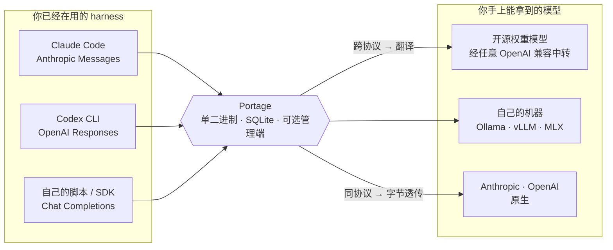

# Portage

**换模型，不换 harness。**

[](https://github.com/SimonGino/portage/actions/workflows/ci.yml)
[](https://go.dev)
[](#快速开始)

[English](README.md) · [简体中文](README.zh-CN.md)

Portage 是一个自建模型网关：把你能拿到的所有模型——官方 API、OpenAI 兼容中转、本机的
Ollama / vLLM——统一纳管到一个地址后面，让 Claude Code、Codex CLI 这些 agent harness
想跑哪个模型就跑哪个。

做法是协议互转。harness 各说各的协议（Claude Code 说 Anthropic Messages，Codex CLI 说
OpenAI Responses，而绝大多数模型只提供 OpenAI Chat Completions），Portage 在中间做三种
协议的双向翻译，同协议则字节透传。harness 指向 Portage，换模型就是改一行配置——不改客户端，
不 fork harness，不套脚本。



## 能跑什么

| 你想跑的模型 | 从哪儿连 | 在哪个 harness 里 |
| --- | --- | --- |
| **开源权重模型**——这个月哪个好用就哪个 | 任意 OpenAI 兼容端点 | Claude Code · Codex CLI |
| **自己的机器**——Ollama、vLLM、LM Studio、MLX | 本机的 Chat Completions | Claude Code · Codex CLI |
| **你已经在付费的中转或聚合站** | Chat Completions 或 Responses | Claude Code · Codex CLI |
| **公司内部那套部署** | 三种协议里它露出来的那种 | Claude Code · Codex CLI |
| **Anthropic 和 OpenAI 自己** | 各自原生协议，字节不动 | Claude Code · Codex CLI |

把两家大厂横着串——Claude 模型放进 Codex CLI、GPT 模型放进 Claude Code——是同一套机制的副
产品，不是目的。

以上每条路径都支持流式（SSE）与 tool calling。对 agent harness 来说这两项不是特性，是及格
线——不支持它们的转换路径等于没做。

## 顺带解决的几件事

请求都从一个地方走之后，下面这些就是白捡的：

| | |
| --- | --- |
| **换上游不动客户端** | **接入点**是对外那个稳定的模型名，底下绑真实上游。挪一次，所有 harness 跟着走。 |
| **不再把真上游 key 发出去** | Portage 自己签发 `sk-ptg-…`。上游凭证不出服务端，不进日志，不进错误回显。 |
| **半夜一把 key 挂了还能活** | 每个渠道是一池凭证。401 把这把摘出轮换，请求接着用下一把跑完。 |
| **搞清楚 token 花在哪** | 每次调用一行：模型、渠道、真正用上的那份凭证、token 数（含缓存读写）、状态与耗时。 |

> *portage（名词）：* 在两段不通航的水道之间，把船和货扛过陆地。
> **扛过去是有代价的，能漂过去就别上岸。** 这既是名字的来历，也是实现上的硬约束：两侧协议
> 本来就一样时走原始字节转发，一个字节都不动；非转不可才拆成 canonical 事件序列重编，且丢
> 了什么要在日志里说得出来。

## 快速开始

同一个二进制跑两种形态，分界只有一条：有没有设管理密码。

| | 管理密码 | 业务配置 | 用在哪 |
| --- | --- | --- | --- |
| **带管理端** | 设了 | 落在库里，点着改 | 你**用来配**的那台 |
| **纯转发** | 哪儿都没设 | 来自声明文件 | 你**部署到**的那台 |

正经路子是两台都要，三步：**本地开着管理端配好 → 导出一份 `channels.yaml` → 把这份文件
部署到一台纯转发实例上。**

### 1. 本地配，带管理端

```bash
PORTAGE_ADMIN_PASSWORD='想好的密码' \
  docker compose -f deploy/docker-compose.yml up -d --build
```

起来后开 <http://127.0.0.1:8317/admin> 登录，依次配渠道 → 纳管模型 → 接入点 → API Key。
上游也在这台上测通：纯转发实例不主动探任何东西，你在这台上没验过的，就没人验了。

### 2. 导出 `channels.yaml`

管理端左栏底下那一个按钮，整份业务配置写成一个文件，运行期状态一样不带。**文件里是明文秘
密**，落盘 0600，永远别提交——`.gitignore` 里已经有它了。

### 3. 部署，纯转发

把文件挂进去，`PORTAGE_CHANNELS` 指过去，管理密码一个都不设：

```yaml
# deploy/docker-compose.override.yml——compose 会自动合并进来
services:
  portage:
    environment:
      PORTAGE_CHANNELS: /etc/portage/channels.yaml
    volumes:
      - ./channels.yaml:/etc/portage/channels.yaml:ro
```

挂了文件，这份文件就是业务配置的唯一事实源；配置里静态就能判出的错一律拒绝启动，退出码 1，
一次把问题全报出来。

每一步的完整说明——空库警告、导出物里有什么没什么、失败模式与重启循环、后面怎么改配置、手
写 `channels.yaml`、从源码构建、公网暴露——见 **[部署文档](docs/deploy.zh-CN.md)**。

## 接 Claude Code

```bash
export ANTHROPIC_BASE_URL=http://127.0.0.1:8317
export ANTHROPIC_AUTH_TOKEN=sk-ptg-…    # Portage 签发的 key，不是上游 key
export ANTHROPIC_MODEL=gw-sonnet        # 接入点名，或限定名 渠道名/模型名
claude
```

配置就这些。Claude Code 照旧发 Anthropic Messages，是原样发出去还是先翻成 Chat Completions
或 Responses，由网关按渠道决定。key 走 `x-api-key` 或 `Authorization: Bearer` 都认，所以用
`ANTHROPIC_API_KEY` 也一样。

Claude Code 还会拿一个小快模型跑后台请求（起标题、做摘要）——老版本是
`ANTHROPIC_SMALL_FAST_MODEL`，新版本是 `ANTHROPIC_DEFAULT_HAIKU_MODEL`。这个也指到一个接入
点上，否则那些请求会去找一个你上游未必有的模型名。

## 接 Codex CLI

在 `~/.codex/config.toml` 里把 Portage 配成自定义 provider：

```toml
model_provider = "portage"

[model_providers.portage]
name = "Portage"
base_url = "http://127.0.0.1:8317/v1"
wire_api = "responses"          # 走 /v1/responses，网关按渠道决定要不要转
env_key = "PORTAGE_API_KEY"     # 值是 API Key（sk-ptg-…），不是上游 key

[profiles.sonnet]
model = "gw-sonnet"
model_provider = "portage"
model_context_window = 200000   # 按**上游真实窗口**写
```

**`model_context_window` 必须自己设**，这是网关侧唯一无法代劳的一件事：Codex 不读
`/v1/models`，它认的是自己内置的模型目录。起了 `gw-sonnet` 这类自定义名字，Codex 就会吃
fallback 的 272k、把自动压缩的触发点摆在约 245k 上；上游真窗口更小的话，请求会先撞上游的
400，压根轮不到压缩。

<details>
<summary>压缩（remote compaction）是怎么处理的——长会话必读</summary>

Codex 到点会发一个 input 尾部带 `compaction_trigger` 的请求，并要求响应里**恰好一个**
compaction item，收不到就当场 Fatal 且不重试。Portage 分两档处理：

- **Responses 透传**：只在上游自己认得这个 trigger 的渠道上放行——在渠道页把「Codex 压缩」
  勾成「支持」。没勾则明确拒绝（400，文案说明原因），而不是转发出去让 Codex 收到一个空的
  压缩结果。**Responses 形状的 wire 不等于支持压缩。**
- **转换路径**（Responses → Anthropic / Chat Completions）：走本地合成。网关把压缩 turn 改
  写成一次纯总结请求打给上游，再把摘要装进自造信封（`ptg1:` + base64）当成恰好一个
  compaction item 发回去；下一轮 Codex 回带时再拆开还原。渠道上那个勾选不管这条路。

legacy 的 `POST /v1/responses/compact` 不实现，回 501。
</details>

## 管理端

五个页面，每屏回答一个运营问题：**模型 · API Key · 调用记录 · 接入点 · 排行**。层级靠排版
建立，颜色只承载状态与那一抹强调，装饰一律不做。上游凭证只在凭证池那一处可显示、可复制，
列表、流水、错误回显里一律没有。左栏底下还挂着那个导出 `channels.yaml` 的按钮。

**纯转发实例上这一整块都不存在。** 没设管理密码时，`/admin` 与 `/admin/api/*`——连登录和会
话在内——压根不注册：404 是路由给的，不是鉴权给的。没有登录表单可以爆破，也没有管理面会被
不小心暴露出去。还听着的只剩 `/v1` 和 `/healthz`。

<!-- 截图：把脱敏后的 PNG 放进 docs/images/ 再把下面这段取消注释。
     要截哪几张见 docs/images/README.md。

| 模型 | 调用记录 | 排行 |
| --- | --- | --- |
|  |  |  |
-->

完整视觉与交互规范见 [`DESIGN.md`](DESIGN.md)。

## 它是怎么搭起来的

一个**渠道**就是一次上游接入：`base_url` + 它能说的协议集 + 你在它上面纳管的模型 + 一池凭证。
**接入点**是 harness 要的那个模型名，底下绑从这些渠道里挑出来的候选；也可以跳过它，用限定名
`渠道名/模型名` 直连纳管模型。

- **知道什么时候该停的重试**。同一凭证内退避（默认 2 次），渠道内换下一把凭证，全局尝试上限
  封顶。401 摘除该凭证、人工恢复；403 换而不摘——那多半只是这把 key 没开通这个模型。流式已写
  出首字节后一律不重试：首字节边界即承诺边界。
- **数字出自上游，不是估的**。转换路径从 canonical 流上读，透传路径靠旁路 Tap 只读提取，客户
  端收到的字节一个不动。
- **单二进制**。React 管理端 embed 进 Go 二进制，SQLite 落库。没有 Redis，没有 sidecar，没有
  任何外部依赖。

## 协议转换矩阵

对角线是字节透传，六条跨协议路径已全部放开。

| 入站 ＼ 上游 | Chat Completions | Responses | Anthropic |
| --- | --- | --- | --- |
| **Chat Completions** | 透传 | ✅ | ✅ |
| **Responses** | ✅ | 透传 | ✅ |
| **Anthropic Messages** | ✅ | ✅ | 透传 |

端点：`/v1/messages`、`/v1/messages/count_tokens`、`/v1/chat/completions`、`/v1/responses`，
另有 `/v1/models`（按接入点与协议交集出清单）与免鉴权的 `/healthz`。

矩阵全开后仍会回 501 的只剩 `/v1/messages/count_tokens` 落到非 Anthropic 渠道：那个端点在另
外两种协议里没有对应物，是**没得做**而不是「还没做」。

转换走枢纽式而非网桥式：每个协议实现一个 `Codec`，`A→B` = CodecA 解成 canonical + CodecB 编
出去，不存在两两互转器。每条路径先备真实 harness 发包与 SSE 转录的 golden 样本，再写实现。

## 配置

两份文件，各答各的问题：`config.yaml` 只管启动（监听地址、库路径、管理密码初始化、重试参
数、全局限流），整个文件都可以省；业务配置——渠道、纳管模型、接入点、候选、凭证、API Key——
只有一个事实源，没挂声明文件时是库、管理端直接改，挂了 `channels.yaml` 时是文件、启动时
apply 进库。完整规则见[部署文档](docs/deploy.zh-CN.md#配置文件)。

## 明确不做

多用户与租户、计费与充值、兑换码、通知、评测、ES 日志、模型训练相关的一切；new-api 式的
「用户等级 × 渠道分组」体系不做——权重分流是路由，不是运营。图像生成与 audio 端点 v1 不做。

**Responses 的有状态子路径不做。** 带 `previous_response_id` 的请求明确回 400，而不是把这个
字段静默丢掉——丢了客户端以为历史还在、实际每轮都是单轮，劣化看不见。转换路径一律拒，同协议
透传看渠道上那一位「支持有状态续链」，出厂取是。

**能力探测不做。** 模型支不支持工具调用/思考，探不准、不可证伪、且没有消费者——网关不按能力
拦请求。真需要这类信息时从调用流水里学：观测到的行为不会过期，自称的能力会。

## 状态

已交付：透传骨架、API Key 与用量流水、六条转换路径与同凭证退避重试、管理端与凭证池、声明式
`channels.yaml` 及其导出按钮与纯转发形态。

进行中：多候选加权分流与候选间故障转移。语义已拍板，实现落地之前，配置上仍强制单候选。

进行中的工作在 [Issues](https://github.com/SimonGino/portage/issues)。

## 文档

| 文档 | 层级 | 说明 |
| --- | --- | --- |
| [docs/deploy.zh-CN.md](docs/deploy.zh-CN.md) | 运维 | 两种形态、三步工作流、手写路径、公网暴露、配置文件 |
| [docs/口径层设计.md](docs/口径层设计.md) | 口径层 | 需求口径、转换矩阵、边界与非目标、决策版本记录 |
| [docs/MVP设计草案.md](docs/MVP设计草案.md) | 展开层 | 模块划分、canonical 事件模型、codec 接口、数据模型、golden 测试方案 |
| [CONTEXT.md](CONTEXT.md) | 术语表 | 领域语言词典（接入点／候选／渠道／凭证池／API Key……） |
| [DESIGN.md](DESIGN.md) | 设计规范 | 管理端视觉与交互原则 |

两份设计文档冲突时以口径层 §6 为准。

## 参考与致谢

从头重写，不 fork 代码。协议细节、字段语义与转换坑参考了这些项目：

- [new-api](https://github.com/QuantumNous/new-api) —— Go 网关的转发内核、SSE 流式转发、
  key 鉴权与渠道路由。
- [sub2api](https://github.com/Wei-Shaw/sub2api) —— 协议转换的 Go 实现首要参考，其
  `apicompat/` 覆盖本项目全部转换方向。**LGPL-3.0：本项目参考的是实现思路与字段语义，
  不复制代码。**
- [litellm](https://github.com/BerriAI/litellm) —— 字段映射最全的对照物，thinking、
  tool calling、usage 语义以它逐 provider 核对。
- [opencodex](https://github.com/lidge-jun/opencodex) —— Codex CLI 客户端行为兼容的首要
  参考：自动压缩、reasoning 回放、Responses SSE 事件线。
- [CLIProxyAPI](https://github.com/router-for-me/CLIProxyAPI) —— thinking/reasoning 跨协议
  保真与 signature 处置这一主题的首要参考（主题之外不参考）。
